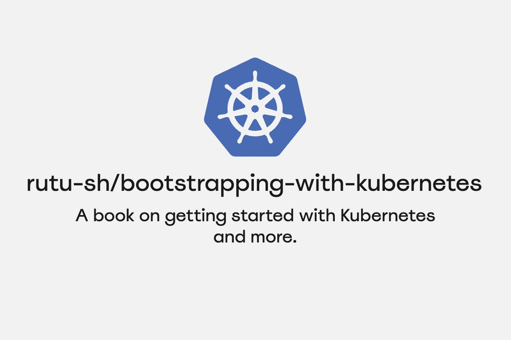

### Namaste! :pray:

- 🔭 I’m currently researching on eBPF and Database Security
- 🌱 I’m currently learning eBPF and Kubernetes
- 📑 Currently working on: [rutu-sh/bootstrapping-with-kubernetes](https://github.com/rutu-sh/bootstrapping-with-kubernetes)
- 📫 How to reach me: [LinkedIn - @rutu-sh](https://www.linkedin.com/in/rutu-sh/)

**Know more about me at [rutu-sh.github.io](https://rutu-sh.github.io/)**

## Bootstrapping with Kubernetes

<!-- I'm writing a book for those who want to start with Kubernetes and want to explore how the entire Kubernetes ecosystem functions with different tools. This is also an effort to help others appreciate the elegance of Kubernetes. The book is available [here](https://rutu-sh.github.io/bootstrapping-with-kubernetes/). -->

<!--  -->

<!-- 

 -->

<table>
  <tr>
    <td>
      

        

          I'm writing a book for those who want to start with Kubernetes and want to explore how the entire Kubernetes ecosystem functions with different tools. This is also an effort to help others appreciate the elegance of Kubernetes. The book is available <a href="https://rutu-sh.github.io/bootstrapping-with-kubernetes/">here</a>.
        

      

    </td>
    <td>
      

        
      

    </td>
  </tr>
</table>

## CloudLab Projects 

<!-- create a grid of three columns, each column will contain an svg -->
<!-- each svg will be a link to the respective project -->
<!-- the svg will be created using https://socialify.git.ci/ -->

  

    <!-- Link and SVG for Project 1 -->
    
  

  

    <!-- Link and SVG for Project 2 -->
    
  

  

    <!-- Link and SVG for Project 2 -->
    
  

  

    <!-- Link and SVG for Project 3 -->
    
  

## OpenTelemetry and Kubernetes

  

    <!-- Link and SVG for Project 3 -->
    
  

  

    

     Kubernetes and Opentelemetry are the two widely used CNCF projects. I'm doing some experiments with setting up Opentelemetry in a variety of configurations inside a Kubernetes cluster. 
    

  

