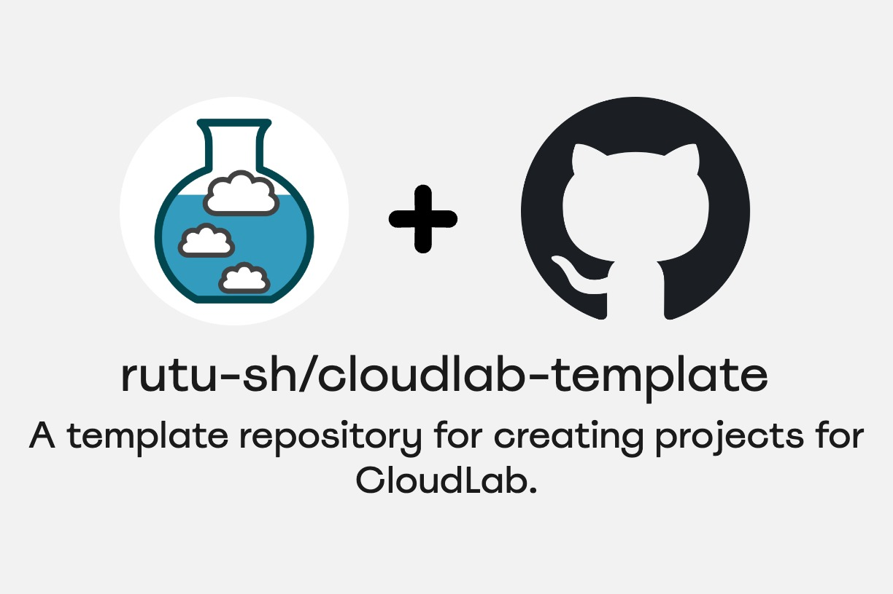

### Namaste! :pray:

- 🔭 I’m currently researching on eBPF and Database Security
- 🌱 I’m currently learning eBPF and Kubernetes
- 📑 Currently working on: [rutu-sh/bootstrapping-with-kubernetes](https://github.com/rutu-sh/bootstrapping-with-kubernetes)
- 📫 How to reach me: [LinkedIn - @rutu-sh](https://www.linkedin.com/in/rutu-sh/)

**Know more about me at [rutu-sh.github.io](https://rutu-sh.github.io/)**

## Bootstrapping with Kubernetes

<table>
  <tr>
    <td>
      

        

          I'm writing a book for those who want to start with Kubernetes and want to explore how the entire Kubernetes ecosystem functions with different tools. This is also an effort to help others appreciate the elegance of Kubernetes. The book is available <a href="https://rutu-sh.github.io/bootstrapping-with-kubernetes/">here</a>.
        

      

    </td>
    <td>
      

        
      

    </td>
  </tr>
</table>

## CloudLab Projects 

These are a few projects and tools I have been developing for researchers to work with different technologies on CloudLab. 

<table>
  <tr>
    <td>
      

        
      

    </td>
    <td>
      

        
      

    </td>
  </tr>
    <tr>
    <td>
      

        
      

    </td>
    <td>
      

        
      

    </td>
  </tr>
</table>

## OpenTelemetry and Kubernetes

<table>
  <tr>
    <td>
      

        
      

    </td>
    <td>
      

        

         Kubernetes and Opentelemetry are the two widely used CNCF projects. I'm doing some experiments with setting up Opentelemetry in a variety of configurations inside a Kubernetes cluster. 
        

      

    </td>
  </tr>
</table>
